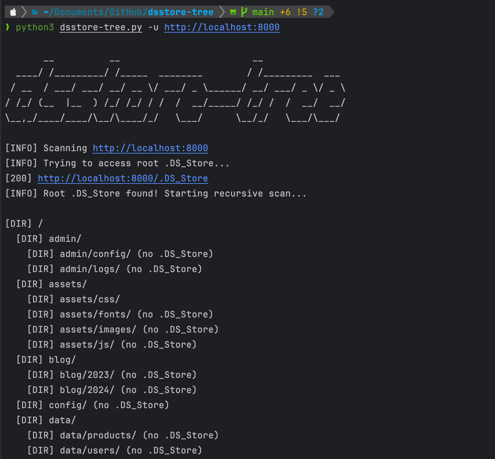

# dsstore-tree

`dsstore-tree` is a tool to recursively discover files and directories on web servers by parsing exposed `.DS_Store` files (macOS metadata files).

# Features



- **Recursive Discovery**: Automatically finds and scans nested `.DS_Store` files
- **Directory Structure Mapping**: Builds complete directory tree from discovered files
- **Download & Mirror**: Option to download all discovered files with original directory structure

# Usage

```shell
python3 dsstore-tree.py -h
```

```yaml
usage: dsstore-tree.py [-h] -u URL [-d] [-q]

  dsstore-tree is a tool to discover files and directories through .DS_Store exposure.

optional arguments:
  -h, --help         show this help message and exit
  -u URL, --url URL  Base URL to scan (e.g., https://example.com)
  -d, --download     Download and mirror discovered files and directories
  -q, --quiet        Supress output where possible
```

# Installation

Install via `pipx`:

```
pipx install git+https://github.com/vflame6/dsstore-tree.git
```

Manual installation:

```shell
git clone https://github.com/vflame6/dsstore-tree.git
cd dsstore-tree
pip3 install -r requirements.txt
```

# About .DS_Store information disclosure issue

A .DS_Store (Desktop Services Store) file is a hidden file created by the macOS operating system. It is used by Finder to store custom attributes of a folder, such as the positions of icons, the choice of background image, and other view options. Each directory in macOS can have its own .DS_Store file.

These files contain:

- Filenames in the directory
- View settings and metadata
- Information about files that may not be linked elsewhere

For more information see following links:

- https://wh1c4t.medium.com/extract-file-from-ds-store-815a22542da9
- https://www.invicti.com/web-vulnerability-scanner/vulnerabilities/dsstore-file-found/
- https://xelkomy.medium.com/how-i-was-able-to-get-1000-bounty-from-a-ds-store-file-dc2b7175e92c
